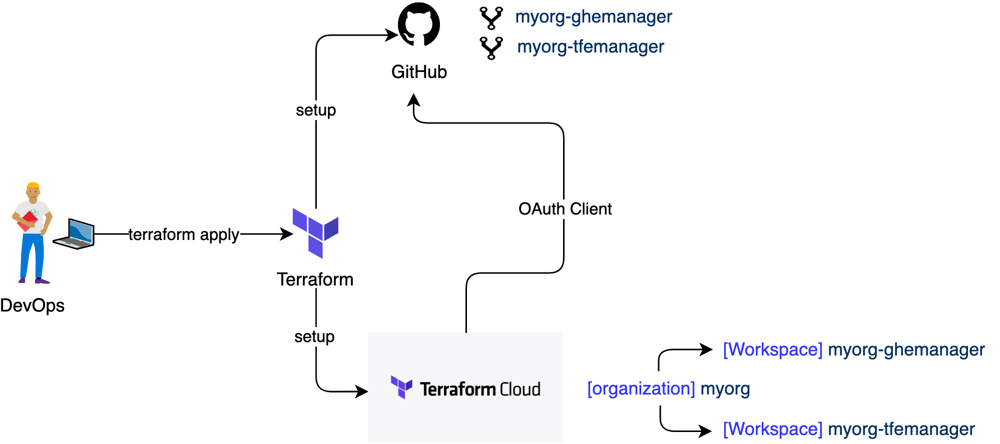

![Contributors][contributors-shield]
![Forks][forks-shield]
![Stars][stars-shield]
![Issues][issues-shield]
![MIT License][license-shield]

 

  

## Project diagram

## Description

[**EACMANAGER**](https://github.com/sanexperts/eacmanager) intends to be the first and last time you use a terminal based _tf_ script in your IAC project if that's what you are trying to. It setups the working Github-Terraform  environment that you can use to start deploying your infrastructure wherever you need to

This is an opensoruce effort any help it's very welcome just check <a href=./README.md/#contributing>Contributing</a> and start

## Prerequisites

- GitHub Organization: As you can see in the diagram above, this project will setup two repositories in your organization. If you are using a free GitHub account, you can setup an organization for [free](https://github.com/pricing).
- Terraform Cloud account: This project also uses Terraform Cloud to set up an organization and two workspaces (one for each repository). You can create an account from [here](https://app.terraform.io/app/organizations).
- Terraform cli: You will need terraform cli installed in your local environment, install it from [here](https://learn.hashicorp.com/tutorials/terraform/install-cli).

## Getting started

1. Clone the repository
2. Copy the file `terraform.tfvars.template` to `terraform.tfvars`
3. Edit the `terraform.tfvars` file with the variables.
4. Run the command `terraform plan`
5. Run the command `terraform apply`

## terraform.tfvars

Variable | Value
------------ | -------------
tfe_hostname | Terraform enterprise host name. If you are using the public GitHub then use `app.terraform.io`
tfe_token | Terraform enterprise token.  This is your USER token (not the organization token or team token). You can get one from [here](https://app.terraform.io/app/settings/tokens)
org_name | Your GitHub organization name
tfe_org_email | Your email
ghe_token | GitHub PAT (Personal Access Token) you can get it from [here](https://github.com/settings/tokens)
ghe_api_url | GitHub API url. If you are using the public GitHub then use `https://api.github.com`
ghe_http_url | GitHub url. If you are using the public GitHub then use `https://github.com`

## Contributing

Contributions are what make the open source community such an amazing place to be learn, inspire, and create. Any contributions you make are **greatly appreciated**.

1. Fork the Project
2. Create your Feature Branch (`git checkout -b feature/AmazingFeature`)
3. Commit your Changes (`git commit -m 'Add some AmazingFeature'`)
4. Push to the Branch (`git push origin feature/AmazingFeature`)
5. Open a Pull Request

## License

Distributed under the MIT License. See [`LICENSE`](LICENSE) for more information.

[contributors-shield]: https://img.shields.io/github/contributors/sanexperts/eacmanager?style=flat-square
[forks-shield]: https://img.shields.io/github/forks/sanexperts/eacmanager?style=flat-square
[stars-shield]: https://img.shields.io/github/stars/sanexperts/eacmanager?style=flat-square
[issues-shield]: https://img.shields.io/github/issues/sanexperts/eacmanager?style=flat-square
[license-shield]: https://img.shields.io/github/license/sanexperts/eacmanager?style=flat-square
